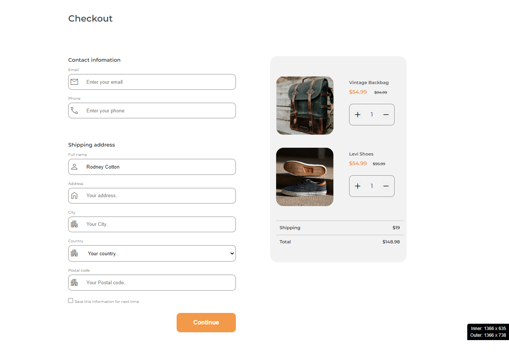

<h1 align="center">{Your project name}</h1>

   Solution for a challenge from  <a href="http://devchallenges.io" target="_blank">Devchallenges.io</a>.

  <h3>
    <a href="https://fascinating-tartufo-ec6b2f.netlify.app/">
      Demo
    </a>
     | 
    <a href="https://devchallenges.io/challenges/0J1NxxGhOUYVqihwegfO">
      Challenge
    </a>
  </h3>

<!-- TABLE OF CONTENTS -->

## Table of Contents

- [Overview](#overview)
  - [Built With](#built-with)
- [Acknowledgements](#acknowledgements)

<!-- OVERVIEW -->

## Overview

This HTML & CSS-only challenge will be perfect for anyone starting to build responsive projects. The challenge is to Create a checkout page following the design. You don’t need to use JS in this challenge but use correct input types and validation. Don’t look at the existing solution.

User should be able to :
   -  see a page following the given design
   -  input email, phone, full name, address, city, country, and postal code
   -  input the number of items
   -  select at least 3 countries from the dropdown

### Built With

- HTML
- CSS custom properties
- Flexbox
- Mobile First Workflow

## Acknowledgements

A big thank you to anyone providing feedback on my solution. It definitely helps to find new ways to code and find easier solutions!

