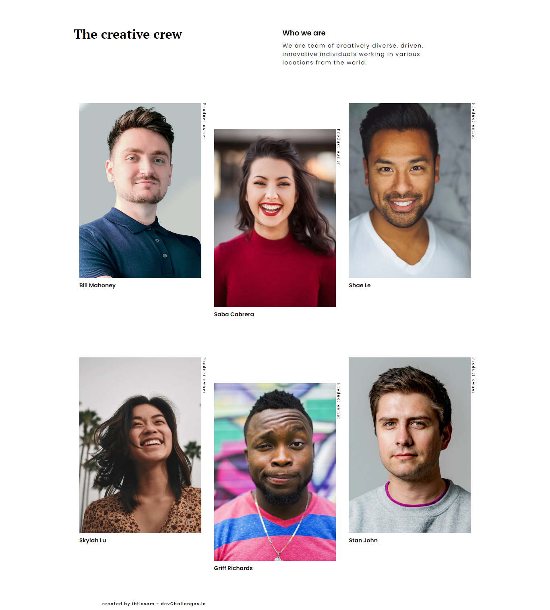

<h1 align="center">Team page solution</h1>

   Solution for a challenge from  <a href="http://devchallenges.io" target="_blank">Devchallenges.io</a>.

  <h3>
    <a href="https://transcendent-taiyaki-746f17.netlify.app/">
      Demo
    </a>
     | 
    <a href="https://devchallenges.io/challenges/hhmesazsqgKXrTkYkt0U">
      Challenge
    </a>
  </h3>

# Overview

Another Great Project to practice some CSS Grid. The challenge is to build out this landing page and get it looking as close to the design as possible. You can use any tools you like to help you complete the challenge. So if you've got something you'd like to practice, feel free to give it a go.

## Built With

- HTML5
- CSS GRID
- CSS custom properties (variables)
- Mobile-First Workflow

## Acknowlegements

A big thank you to anyone providing feedback on my solution. It definitely helps to find new ways to code and find easier solutions!
